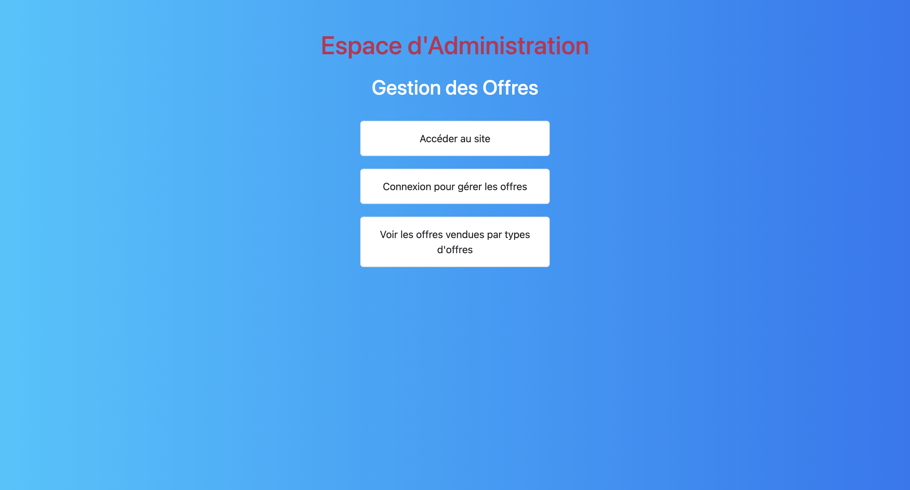

# Olympic Tickets – Application Spring Boot

Ce projet est en lien avec l'application **gestion-offres** qui lui sert de back-office.

Visitez l'application : [https://olympic-tickets-e061c8748c8b.herokuapp.com/users/home](https://olympic-tickets-e061c8748c8b.herokuapp.com/users/home)

---

## 🖼️ Aperçu de l'application

Voici un aperçu de l'application Olympic Tickets :


---

## Manuel d’Utilisation Olympic Tickets

### ✨ Introduction
Ce manuel d'utilisation est conçu pour guider les utilisateurs à travers les différentes fonctionnalités de l'application Olympic Tickets. Il fournit des instructions sur la création d'un compte, la réservation de tickets et la gestion des offres pour les administrateurs.

---

### Création d'un Compte Utilisateur

#### Étapes pour S'inscrire
1. **Accéder à la page d'inscription**
    - Rendez-vous sur la page d'accueil de l'application.
    - Cliquez sur le lien "Inscription".
2. **Remplir le Formulaire d'Inscription**
    - **Nom et Prénom** : Saisissez vos informations personnelles.
    - **Adresse E-mail** : Fournissez une adresse e-mail valide.
    - **Mot de Passe** : Créez un mot de passe sécurisé.
    - **Validation** : Cliquez sur le bouton "S'inscrire".
3. **Confirmation de l'Inscription**
    - Un e-mail de confirmation sera envoyé à votre adresse. Suivez les instructions pour activer votre compte.

---

### Connexion à votre Compte

#### Étapes pour se Connecter
1. **Accéder à la page de connexion**
    - Cliquez sur le lien "Connexion" depuis la page d'accueil.
2. **Saisir vos Informations**
    - **Adresse E-mail** : Entrez l'adresse e-mail utilisée pour vous inscrire.
    - **Mot de Passe** : Saisissez votre mot de passe.
3. **Validation**
    - Cliquez sur le bouton "Se connecter". Vous serez redirigé vers la page des offres si les informations sont correctes.

---

### Réservation de Tickets

#### Étapes pour Réserver des Tickets
1. **Voir les Offres**
    - Sur la page des offres, cliquez sur "voir les offres de tous les billets".
2. **Sélectionner une Offre**
    - Parcourez les offres disponibles (Solo, Duo, Familiale).
    - Cliquez sur "Réserver" pour l'offre qui vous intéresse.
3. **Finaliser la Réservation**
    - Accédez à votre panier en cliquant sur l'icône du panier.
    - Vérifiez les détails de votre commande.
    - Cliquez sur "Procéder au paiement".
4. **Recevoir le e-billet**
    - Une fois le paiement effectué, vous recevrez un e-billet avec un QR code par e-mail.

---

## Gestion des Offres (Administrateurs) – via l'application Gestion-offres réservée aux administrateurs

---

### 🛠️ Gestion des Offres – Interface Admin



#### Étapes pour Gérer les Offres
1. **Connexion à l'Espace Administrateur**
    - Utilisez vos identifiants administrateur.
    - Vous serez redirigé vers la page de gestion des offres.
2. **Gérer les Offres**
    - **Ajouter une Offre** : Remplissez le formulaire et cliquez sur "Ajouter".
    - **Modifier une Offre** : Cliquez sur "Modifier", apportez les changements et enregistrez.
    - **Supprimer une Offre** : Cliquez sur "Supprimer", confirmez avec "oui".
3. **Déconnexion**
    - Cliquez sur "Déconnexion" en haut à droite de la page.

---

### Sécurité
- Ne partagez jamais vos informations de connexion.
- Changez régulièrement votre mot de passe.

---

### Support et Contact
Pour toute question ou problème, contactez notre support :
- Email : support@olympictickets.com (fictif)
- Téléphone : 01 23 45 67 89 (fictif)

---

## Infos pour les développeurs
### Variables d’Environnement (.env) 

Ce projet utilise un fichier `.env` pour gérer les variables d’environnement sensibles.

### Mise en place en local

1. Copiez le fichier d'exemple à la racine du projet :
   ```bash
   cp .env.example .env
   ```

2. Remplissez vos variables dans le fichier `.env` :
    - URL base de données
    - Identifiants DB
    - Clé secrète JWT
    - Paramètres SMTP (si besoin)

3. Le fichier `.env` est **ignoré par Git** (voir `.gitignore`).

### Exécution avec `.env`

```bash
source .env && ./mvnw spring-boot:run
```

## Crédit

Projet développé par **SOUANGUIPALI ALZOUMA Palou (ASP)**

Développeur Java / Spring Boot / React / DevOps 

---

